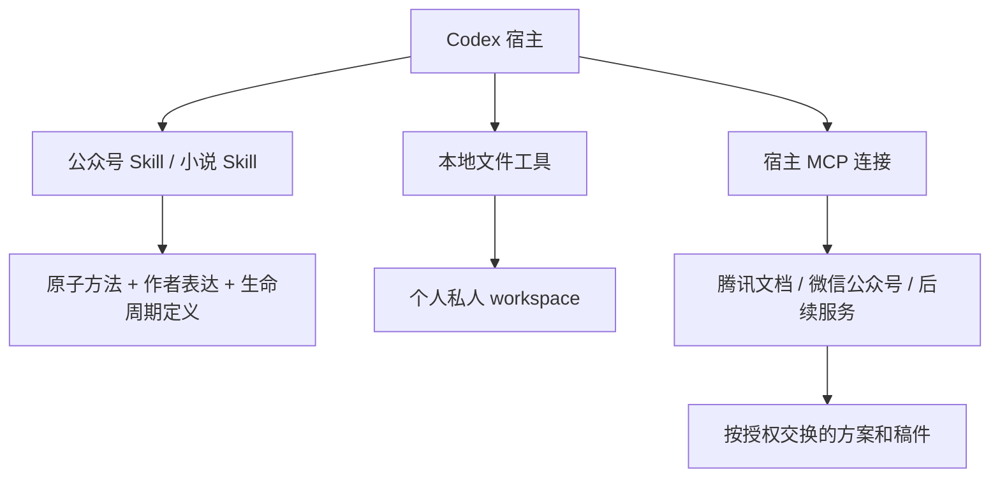

# 头哥写作工作台 · v2.2

在 Codex 中创作公众号单篇和长篇小说。两项写作 Skill 共享作者表达包和 13 项原子方法；每个人在自己的私人 workspace 保存素材、方案、正文、决定与历史。

v2.2 推荐将作品放在项目之外的 `~/.touge-writing/workspace/`，更新公共能力时继续使用原来的私人资料。合作作者各自保留 workspace，通过腾讯文档交换选定的方案、待审稿与共同确认稿。[升级与迁移](docs/migration-v2.2.md)

| 入口 | 用途 |
|---|---|
| [公众号写作](.agents/skills/touge-wechat-writing/README.md) | 短篇、单篇；直接成稿、修改、审阅与发布准备 |
| [小说写作](.agents/skills/touge-novel-writing/README.md) | 全书与章节规划、场景、连载、连续性及版本继承 |
| [作者表达包](shared/author-expression/README.md) | 可独立分享的判断、语言与词汇偏好；仍为 1.0.0 |
| [原子能力](capabilities/README.md) | 13 项按需组合的方法；不持有作品事实或定稿状态 |

原有交流、Reboot、产品问答、讲稿与内容交付入口保留，见 [辅助能力](docs/auxiliary-guide.md)。

## 安装和开始

核心工具使用 Python 3.9+ 标准库，支持 macOS/Linux。Codex 执行写作与工具调用，本项目没有独立模型服务。取得完整项目后，在项目根目录运行：

```bash
python3 scripts/writing_workspace.py --workspace "$HOME/.touge-writing/workspace" init --id my-novel --title "我的小说" --type novel
python3 scripts/writing_workspace.py --workspace "$HOME/.touge-writing/workspace" init --id first-article --title "第一篇文章" --type wechat
python3 scripts/writing_workspace.py --workspace "$HOME/.touge-writing/workspace" resume --project my-novel
```

在 Codex 打开完整目录，用 `$touge-novel-writing` 或 `$touge-wechat-writing` 提出任务。新书先建立自己的全书方案、章配置和设定；单篇可按请求直接成稿。已有授权继续有效，不因版本升级重走作者审批。

**GitHub 提供能力、模板和工作区格式说明；init 在本地创建自己的作品。** 安装不含私人书稿、历史原文或账号连接。上述目录是推荐位置，脚本不传 `--workspace` 时仍沿用相对当前终端目录的 `workspace`，以兼容旧命令；新版 Skill 显式使用推荐位置或用户指定位置。已有作品先按 [迁移指南](docs/migration-v2.2.md) 核验，不能用新空工作区替代旧资料。[安装](docs/installation.md) · [目录与字段](docs/workspace.md)

## 写作、协作与连接



正文是否 accepted 只看内容登记与实际作者决定。run 记录本次任务、输入快照、方法版本、审稿与候选产物；完成试写不改变章节定稿。来源、人物、时间线和配额只在相应作品内生效。方法与作者表达可复用，旧书事实不会自动带入新书。

合作时使用 [合作约定](templates/collaboration.md) 确定分工、共享范围和确认人。各自在本地写作，指定负责人汇总共同稿；腾讯文档最新编辑不自动成为定稿。本项目不提供 workspace 共享、自动双向同步或多人自动合并。[合作流程](docs/collaboration.md)

[腾讯文档](docs/external-services/tencent-docs.md) 沿用既有读取、受控 Word 写入和回读协议；未变更的部分在验收时核验历史真实证据，不称为本轮重新实测。微信公众号只建立连接能力与使用约定，真实账号和发布操作未纳入验收。MCP 是外部服务连接，不是写作运行时。

私人文件和备份没有应用层加密。需要加密存储时使用系统磁盘加密或加密卷，并将 `--workspace` 指向对应目录；备份也须采用相应保护。

## 自检与文档

```bash
python3 -m unittest discover -s tests -v
python3 scripts/preflight_check.py
python3 scripts/acceptance.py --public-only
python3 scripts/export_author_profile.py --out dist/touge-author-expression-1.0.0.zip
```

公共自检不需要作者的私人档案。维护者完整验收另含迁移回归和腾讯文档证据；合成写作和协作演练不代签作者审美认可，也不证明真实多人并发编辑已经验证。[测试与验收](docs/testing.md) · [v2.2.0 验收记录](docs/release-v2.2.md)

[文档导航](docs/README.md) · [命令参考](docs/cli.md) · [素材](docs/materials.md) · [运行恢复](docs/runs.md) · [合作](docs/collaboration.md) · [迁移](docs/migration-v2.2.md) · [发布](docs/releasing.md) · [变更记录](CHANGELOG.md)
