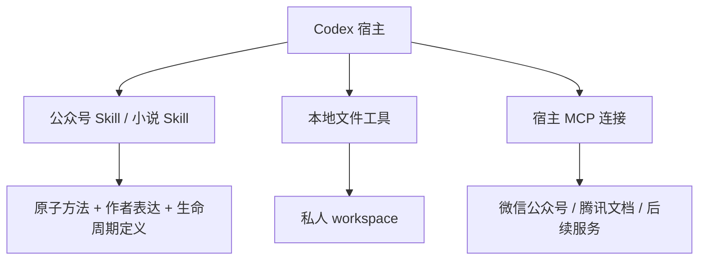

# 头哥写作工作台 · v2.1

在 Codex 中创作公众号单篇和长篇小说。两项写作 Skill 共享作者表达包和 13 项原子方法；每部作品在本地 workspace 保存自己的素材、方案、正文、决定与历史。

v2.1 增加事件与主题素材发现、多对多使用映射、方法版本锁定和可恢复的任务记录。写作时不仅保存来源，还要求交付有叙事或论证增量的正文，审查换词后的重复感悟，并按具体授权区分真实材料、小说化重构和纯虚构。

| 入口 | 用途 |
|---|---|
| [公众号写作](.agents/skills/touge-wechat-writing/README.md) | 短篇、单篇；直接成稿、修改、审阅与发布准备 |
| [小说写作](.agents/skills/touge-novel-writing/README.md) | 全书与章节规划、场景、连载、连续性及版本继承 |
| [作者表达包](shared/author-expression/README.md) | 可独立分享的判断、语言与词汇偏好；仍为 1.0.0 |
| [原子能力](capabilities/README.md) | 13 项按需组合的方法；不持有作品事实或定稿状态 |

原有交流、Reboot、产品问答、讲稿与内容交付入口保留，见 [辅助能力](docs/auxiliary-guide.md)。

## 安装和开始

核心工具使用 Python 3.9+ 标准库，支持 macOS/Linux。Codex 执行写作与工具调用，本项目没有独立模型服务。

```bash
git clone --branch v2.1.0 https://github.com/yeliang-wang/touge-writing-reboot-skill.git
cd touge-writing-reboot-skill
python3 scripts/writing_workspace.py init --id my-novel --title "我的小说" --type novel
python3 scripts/writing_workspace.py init --id first-article --title "第一篇文章" --type wechat
python3 scripts/writing_workspace.py resume --project my-novel
```

在 Codex 打开完整目录，用 `$touge-novel-writing` 或 `$touge-wechat-writing` 提出任务。新书先建立自己的全书方案、章配置和设定；单篇可按请求直接成稿。已有授权继续有效，不因版本升级重走作者审批。

**workspace 在本地初始化，不随 GitHub 或发行包分发。** 安装没有私人书稿、历史原文或任何人的账号连接。可以用 `--workspace` 选择仓库外目录，详见 [安装](docs/installation.md)和 [工作区](docs/workspace.md)。

## 写作、记录与连接



正文是否 accepted 只看内容登记与实际作者决定。run 记录本次任务、输入快照、方法版本、审稿与候选产物；完成试写不改变章节定稿。来源、人物、时间线和配额只在相应作品内生效。方法与作者表达可复用，旧书事实不会自动带入新书。

[腾讯文档](docs/external-services/tencent-docs.md)沿用已经验证的读取、受控 Word 写入和回读协议；v2.1 对未变更协议核验既有证据，不冒称本轮重新实测。微信公众号只建立连接能力与使用约定，真实账号和发布操作未纳入验收。MCP 是外部服务连接，不是写作运行时。

## 自检与文档

```bash
python3 -m unittest discover -s tests -v
python3 scripts/preflight_check.py
python3 scripts/acceptance.py --public-only
python3 scripts/export_author_profile.py --out dist/touge-author-expression-1.0.0.zip
```

公共自检不需要作者的私人档案。维护者完整验收另含迁移回归和腾讯文档证据；写作评测是有界合成案例的实际正文与审读，机器检查不代签作者审美认可。[测试与验收](docs/testing.md)

[文档导航](docs/README.md) · [命令参考](docs/cli.md) · [素材](docs/materials.md) · [运行恢复](docs/runs.md) · [迁移](docs/migration-v2.1.md) · [发布](docs/releasing.md) · [变更记录](CHANGELOG.md)
