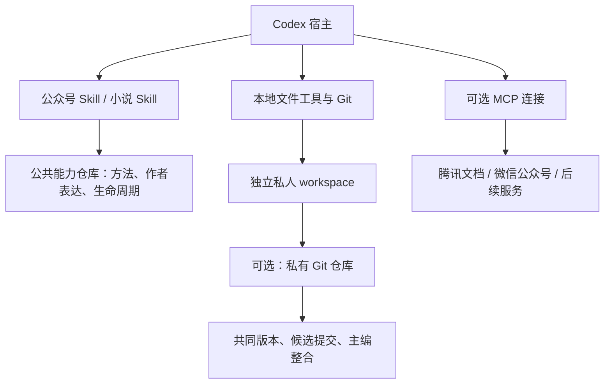

# 头哥写作工作台 · v2.4

在 Codex 中创作公众号单篇和长篇小说。两项写作 Skill 共享作者表达包和 13 项原子方法；作品的素材、方案、正文、决定与历史保存在独立的私人 workspace。

**`touge-writing` 提供公共写作能力，`touge-writing-workspace` 可作为独立私有工作区名称。** 一个 workspace 可以同时管理多部小说和公众号单篇，各作品通过 `catalog.json` 定位。能力项目单独升级，工作区持续保存创作资料；也可以只在本地使用。

v2.4 将作品规则贯穿到写前阅读、方案落点和写后逐项审阅。Markdown 保存完整规则，规则索引帮助确定适用范围与证据；快照只证明文件身份，文学判断仍需阅读实际文字。审阅任务可以完成并得出“稿件仍需修改”，保存候选也不等于合格或作者接受。[规则使用](docs/rules.md)

Git 保存共同版本，指定主编顺序整合和登记；腾讯文档保留为可选导入、审阅和导出渠道。多人访问范围不同时，按权限建立独立仓库；文件夹不能限制仓库成员的读取范围。[迁移到私有 Git](docs/migration-v2.3.md)

| 入口 | 用途 |
|---|---|
| [公众号写作](.agents/skills/touge-wechat-writing/README.md) | 短篇、单篇；直接成稿、修改、审阅与发布准备 |
| [小说写作](.agents/skills/touge-novel-writing/README.md) | 全书与章节规划、场景、连载、连续性及版本继承 |
| [作者表达包](shared/author-expression/README.md) | 可独立分享的判断、语言与词汇偏好；仍为 1.0.0 |
| [原子能力](capabilities/README.md) | 13 项按需组合的方法；不持有作品事实或定稿状态 |

原有交流、Reboot、产品问答、讲稿与内容交付入口保留，见 [辅助能力](docs/auxiliary-guide.md)。

## 安装和开始

核心工具使用 Python 3.9+ 标准库，支持 macOS/Linux。Codex 执行写作与工具调用，本项目没有独立模型服务。取得完整项目后，在项目根目录运行：

```bash
python3 scripts/writing_workspace.py --workspace "$HOME/.touge-writing/workspace" init --id my-novel --title "我的小说" --type novel
python3 scripts/writing_workspace.py --workspace "$HOME/.touge-writing/workspace" init --id first-article --title "第一篇文章" --type wechat
python3 scripts/writing_workspace.py --workspace "$HOME/.touge-writing/workspace" resume --project my-novel
```

在 Codex 打开完整目录，用 `$touge-novel-writing` 或 `$touge-wechat-writing` 提出任务。新书先建立自己的全书方案、章配置和设定；单篇可按请求直接成稿。已有授权继续有效，不因版本升级重走作者审批。

**公共仓库提供能力、模板和格式；私人仓库保存获准共享的作品。** 安装不含私人书稿、历史原文或账号连接。推荐本地位置为 `~/.touge-writing/workspace`；私有仓库可克隆到另一个明确目录，并对每次命令传同一个 `--workspace`。省略该参数仍沿用当前终端目录的 `workspace`，兼容旧命令。已有作品先核对原路径与索引，不能用新空库替代。[安装](docs/installation.md) · [目录与字段](docs/workspace.md)

## 写作、协作与连接



正文是否 accepted 只看内容登记与实际作者决定。run 记录本次任务、输入快照、方法版本、审稿与候选产物；完成试写不改变章节定稿。来源、人物、时间线和配额只在相应作品内生效。方法与作者表达可复用，旧书事实不会自动带入新书。

合作时使用 [合作约定](templates/collaboration.md) 确定共享范围、主编和确认人。协作者从共同 Git 提交取得基准，在独立本地副本中写作，再提交选定候选包；主编核对基准后在正式 workspace 登记新版本。**PR 合并不等于稿件定稿。** 个人运行事件链不能合并进正式链；`git_collaboration.py` 检查候选包和提交边界，不自动合并正文、不代替仓库权限。[合作流程](docs/collaboration.md)

Git 协作使用 Git 或现有 GitHub CLI，不要求 GitHub MCP。[腾讯文档](docs/external-services/tencent-docs.md) 沿用既有读取、受控 Word 写入和回读协议；未变更部分核验历史证据，不称为本轮重新实测。微信公众号只建立连接能力与使用约定，真实账号和发布操作未纳入验收。MCP 是外部服务连接，不是写作运行时。

GitHub Private 提供访问控制，没有实现只有作者持钥的端到端加密。本地文件和备份也没有应用层加密；需要加密存储时使用系统磁盘加密或加密卷，并保护备份。私有 Git 仓库只包含选定资料，不能替代完整个人档案备份。

## 自检与文档

```bash
python3 -m unittest discover -s tests -v
python3 scripts/preflight_check.py
python3 scripts/acceptance.py --public-only
python3 scripts/export_author_profile.py --out dist/touge-author-expression-1.0.0.zip
```

公共自检不需要作者的私人档案。真实迁移、私有远端权限和克隆恢复应另行核验；合成协作演练不代签作者审美认可，也不证明真实多人并发编辑已经验证。[测试与验收](docs/testing.md)

[文档导航](docs/README.md) · [命令参考](docs/cli.md) · [素材](docs/materials.md) · [运行恢复](docs/runs.md) · [合作](docs/collaboration.md) · [更名](docs/rename-v2.3.1.md) · [发布](docs/releasing.md) · [变更记录](CHANGELOG.md)
