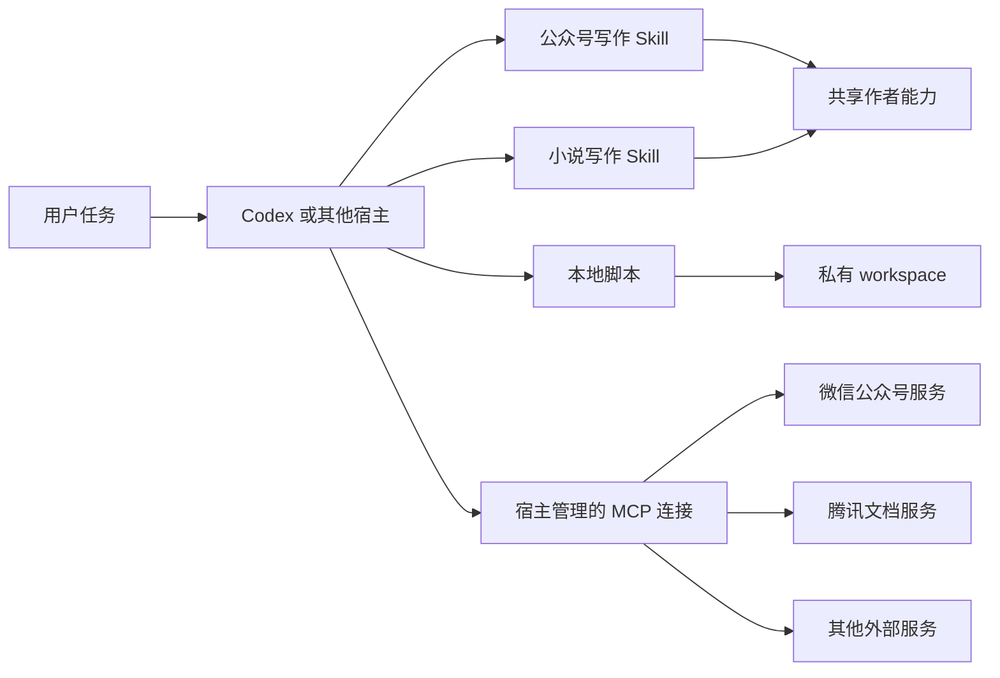

# v2.0 架构与职责

面向维护者和集成者。v2.0 是由宿主执行的写作能力包，核心状态使用本地文件管理。

公众号和腾讯文档在系统外部。MCP 连接不负责保存全书设定、不决定哪一稿定版，也不取代本地版本记录。

## 公共模块

| 模块 | 责任 | 不承担的责任 |
|---|---|---|
| `shared/author-expression/` | 判断方式、语言偏好、词库与文体评价 | 具体小说的人物事实或章节配额 |
| `.agents/skills/` | 两类任务的方法、阶段与交付约定 | 模型服务、账号认证、后台任务调度 |
| `scripts/` | 初始化、检索、版本登记、检查、导出与备份 | 自动创作、外部平台调用、文学质量裁决 |
| `configs/` | 能力声明、来源示例、验收清单 | 自动安装插件或加载真实密钥 |
| `references/`、`templates/`、`prompts/` | 可复用方法、结构和兼容入口 | 私人知识库 |

根 `SKILL.md` 为兼容路由。公众号和小说分别使用独立入口，共享作者能力；交流、Reboot、产品问答、内容交付包保留为辅助场景。

## 私有状态

`workspace/catalog.json` 定位作品；每个作品有自己的 `book.yaml`、`版本记录/revisions.json` 和派生 `state.json`。标题或旧别名只是定位方式，版本归属仍由作品目录限定。书稿、语料、归档和操作回执均保留在本机。

当前版本由登记顺序、状态及父版本关系推导，不依赖文件修改时间。全书新方案不会修改旧章方案的历史父版本。来源文件与登记内容保持不可变，新修改保存为新条目。

CLI 使用项目或工作区文件锁协调写入，并原子替换清单。锁只保护遵守同一协议的进程，直接手工编辑不受保护。这是单机文件工作流，没有数据库事务或多机协同服务。

## 外部操作

宿主读取目标 → 准备本地操作记录 → 调用 MCP → 回读或查询状态 → 保存实际回执。`external_operations.py` 只保存记录；它不会自行验证平台权限或替调用方发请求。相同操作意图再次出现时要求对账，不能把本地操作 ID 当平台的幂等保证。

v2.0 验收包含腾讯文档实际读写。公众号仅建立能力和使用约定，真实连接验收被明确排除。其他服务按[接入约定](external-services/adding-service.md)扩展，无需增加一套插件运行框架。

## 实现选择与限制

核心工具采用 Python 标准库、Markdown、JSON 和兼容 JSON 的 YAML 文件。检索使用词频与余弦相似度，没有向量数据库。风格和结构检查是机械提示，没有事实核验引擎。v2.0 不提供网页编辑器、常驻服务、自动发布器或实时多用户协作。

相关接口见[数据格式](workspace.md)、[命令参考](cli.md)与[测试边界](testing.md)。
